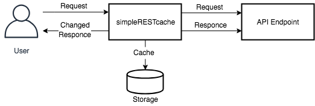
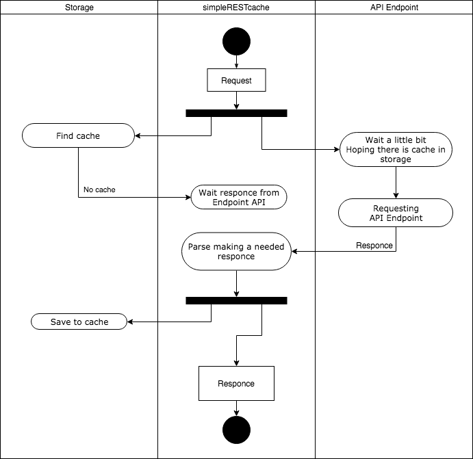
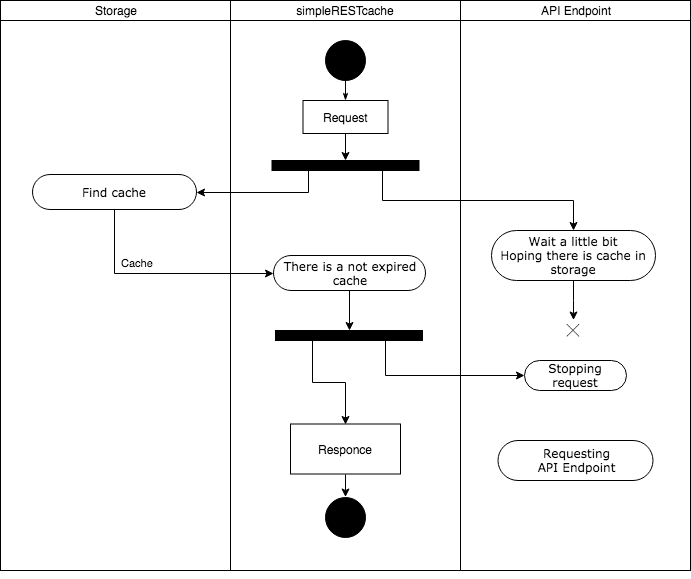
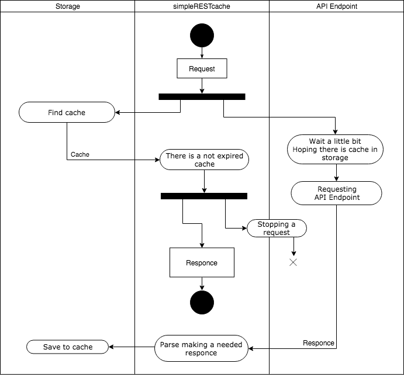
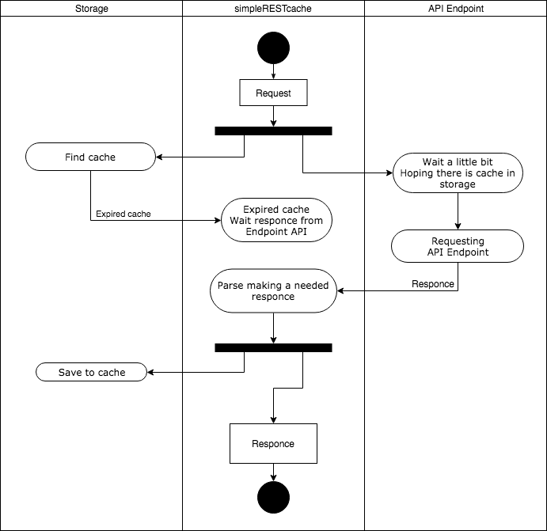

# Transaction App
**simpleRESTcache** is a simple API cache system written on Go.
It stands in front of you API Endpoint and act as a proxy/cache system.
**simpleRESTcache** also has the ability to change an original API Endpoint response and transform it format that you prefer. For example you have original JSON with dozen fields and need only three of them and one field is a concatenation two from original. In other words you can write your own parse logic and easily set **simpleRESTcache** for using it.




# Getting started

## Deploy
* [Docker Compose deploy](https://github.com/Maxfer4Maxfer/simpleNews/blob/master/docs/docker-compose-deploy.md)

## CLI arguments
```bash
Usage of simpleRESTcache:
  -api-URL string
    	URL of an endpoint API (default "https://places.aviasales.ru/v2/places.json")
  -sla duration
    	SLA time is a period for which a response to a client must be provided. Valid time units are "ms", "s", "m", "h" (default 3s)
  -expiredPeriod duration
    	Expired cache duration. Valid time units are "m", "h" (default 24h0m0s)
  -dsn string
    	Database Source Name (default "root:root@tcp(mysql:3306)/cache?charset=utf8&parseTime=True&loc=Local")
  -http-addr string
    	HTTP listen address (default ":8080")
  -control-addr string
    	Control listen address (default ":8081")
  -debug
    	Set debug mode
```

## svcctl
**svcclt** is a simpleRESTcache service management tool.
**svcclt** is command line interface for control a simpleRESTcache instance.
[Read more](./docs/svcctl.md) 

## Change a storage subsystem
There are two storage subsystem exists. One stores cache in memory. Other stores cache in MySQL. 
You can choose one of those. 
By default it stores in MySQL. For change to store cache in memory change in file cmd/simplerestcache/main.go
	storage "simpleRestCache/pkg/storage/inmem"  ->
	storage "simpleRestCache/pkg/storage/gorm"

## Responce parse subsystem
You can easily adjust by changing in file pkg/service/
	parser "simpleRestCache/pkg/parser/aviasalesru/placesjsonv2" ->
	your parser import

See simpleRestCache/pkg/parser/aviasalesru/placesjsonv2 as an example.


## Request handle workflows

First meet a request. There is no cache.




There is a cache. The cache is not expired.
A response time good enough for canceling request to a API Endpoint.




There is a cache. The cache is not expired.
A storage response is very slow for canceling request to an API Endpoint.
Got a responce from API Endpoint and from the storage.




There is a cache. But it is expired.
Wait a responce from an API Endpoint.




Reach SLA! Need to do anything. 
Either return an expired cache or wait a response from an API Endpoint.


## Donations
 If you want to support this project, please consider donating:
 * PayPal: https://paypal.me/MaxFe
